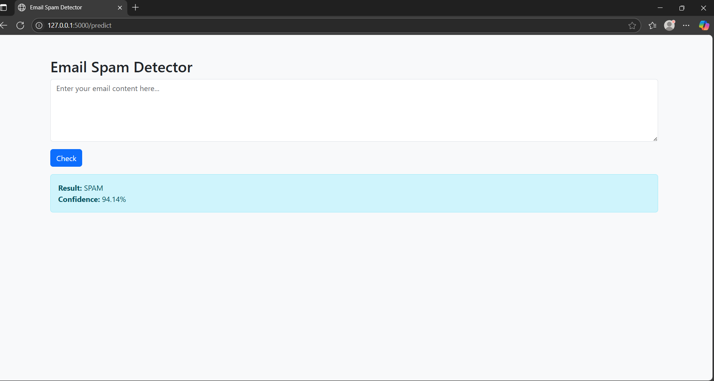

# Email Spam Detector 🔍

An AI-powered web application to classify emails as SPAM or NOT SPAM using machine learning.

## ✨ Features
- Real-time email classification using TF-IDF and Naive Bayes
- Shows confidence level of prediction
- Clean UI built with Flask and Bootstrap

## 💻 Technologies Used
- Python
- Scikit-learn
- Flask
- TF-IDF Vectorizer
- Naive Bayes Classifier

## 🚀 Run Locally

# 1. Clone the repository
git clone https://github.com/Anant2701/email-spam-detector.git

# 2. Navigate into the project directory
cd email-spam-detector

# 3. Install required dependencies
pip install -r requirements.txt

# 4. Train the machine learning model
python train_model.py

# 5. Start the Flask web application
python app.py

Then open (http://127.0.0.1:5000)

## 🧠 Dataset
- [UCI SMS Spam Collection Dataset](https://archive.ics.uci.edu/ml/datasets/SMS+Spam+Collection)

## 📸 Screenshots

### 🏠 Homepage

